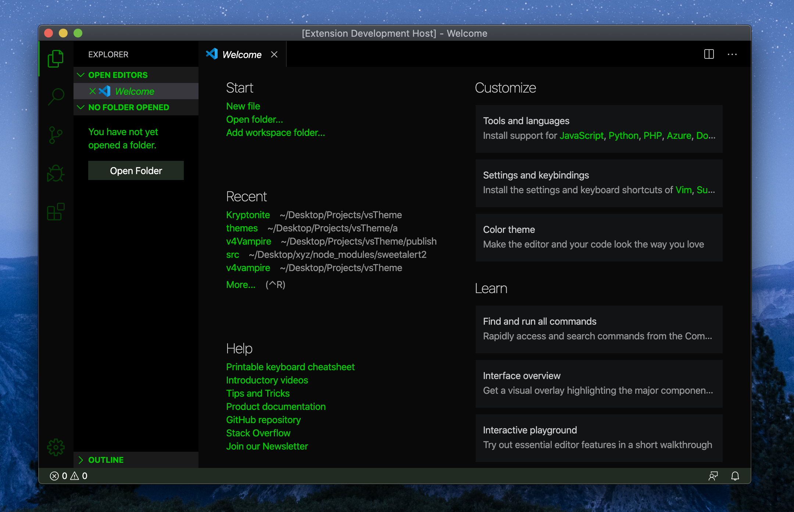
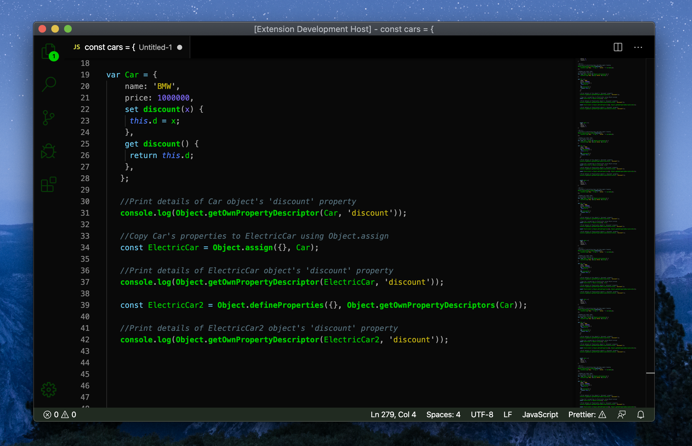
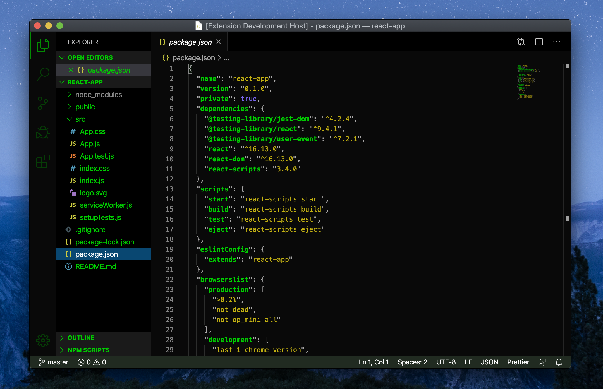
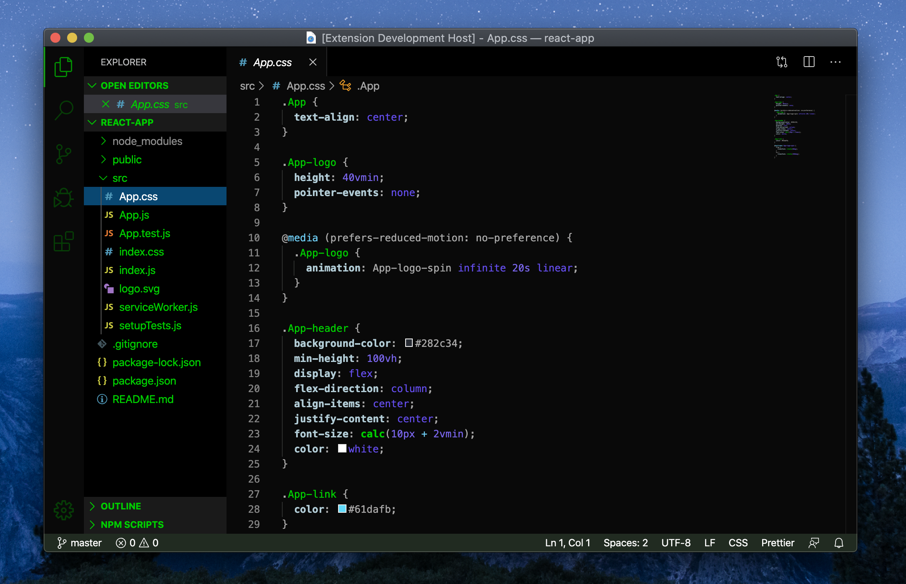

# Kryptonite

This extension for Visual Studio Code ,adds themes titled "Kryptonite".
It is dark and green, a theme.

> I personally use this dark theme for most programming sessions for a shady look.

See the [CHANGELOG](CHANGELOG.md) for the latest changes.

## Dark Green Theme

## Usage

Select the theme and go!

## Installation

1. Open **Extensions** sidebar panel in Visual Studio Code. `View → Extensions`
1. Search for `Kryptonite`
1. Click **Install**
1. Click **Reload**
1. File > Preferences > Color Theme > **Kryptonite**
1. Optional: Use the recommended settings below for best experience

## Feedback

If you have suggestions, please [open an issue](https://github.com/mrityunjay38/Kryptonite/issues) or better yet, a [pull request](https://github.com/mrityunjay38/Kryptonite/pulls).

## Authors

Created by [Mrityunjay](https://github.com/mrityunjay38)